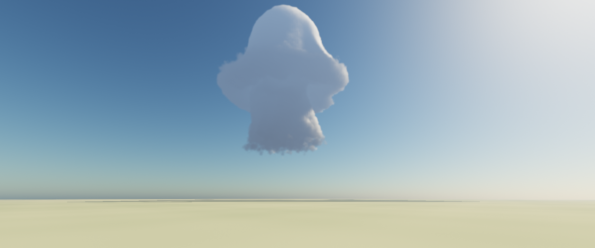

# Storm

A Windows screensaver that grows a cumulus into a cumulonimbus, tilts it into a
supercell, and drops a tornado out of it — with a different storm every run.

Direct3D 12, compute-shader volumetric rendering. Screensaver shell modelled on
[cmillsap/Juggler](https://github.com/cmillsap/Juggler).

**Status: Phase 02 complete.** `Storm.scr` builds, installs and runs, and grows
its own cumulus: the shape on screen comes out of a fluid solver, not a
procedural container. The four validation spikes that preceded it are kept
under `spikes/`.



## Building and running

Requires Visual Studio 2022 with the C++ desktop workload and the Windows
10/11 SDK. No external SDK or package manager — `dxcompiler.dll` and `dxil.dll`
are copied out of the Windows SDK at build time.

```
build.bat                       Release build (or: build.bat Debug)
build\Release\Storm.scr /s      run full screen
build\Release\Storm.scr /c      configuration dialog
```

To install, copy `Storm.scr`, `dxcompiler.dll`, `dxil.dll` and the `shaders`
folder together into a permanent location, then right-click `Storm.scr` and
choose **Install**. They must stay together — the shaders are compiled at
startup, not baked into the executable.

### Development switches

Windows never passes these, so they cannot collide with the screensaver
contract. A screensaver takes over the display, which makes it almost
impossible to inspect while developing; the spikes established that looking at
the image is the only way to catch a renderer that is fast and wrong.

| | |
|---|---|
| `/w` | Run in an ordinary window rather than full screen |
| `/capture <file.bmp> [w h] [seconds]` | Render one frame to disk |
| `/bench [file.txt] [w h] [frames]` | Time the render pipeline |
| `/probe [file.txt]` | Report the monitor layout and the mirroring arithmetic |

`/capture` runs up to the requested moment at the real frame rate rather than
holding time still — with a frozen camera the temporal reprojection is an
identity transform and the capture would prove nothing about it.

Note that `.scr` files have a shell association whose default verb is *Install*,
so launching one from a script needs `UseShellExecute = false` or it will not
run the way you expect.

## Phase 00 — shell and skeleton

- **The `.scr` contract**: `/s` full screen, `/c` configure, `/p <hwnd>`
  preview, including the named-event handshake that lets a new instance evict a
  running preview before claiming its window.
- **Multi-monitor**, one borderless window and swap chain per display, sharing
  a single device, one simulation and one rendered frame.
- **The state/view split** that keeps mirroring a policy rather than an
  assumption — see `src/view.h`.
- **A real Rayleigh/Mie atmosphere** carried over from Spike 02, with the sun on
  a five-minute arc, rather than a placeholder gradient. Phase 01 adds a cloud
  march to this rather than replacing it.
- Frames capped at 30 fps; measured at roughly 6% of one CPU core.

## Phase 01 — volumetric raymarcher

The Spike 02 cumulus, at target resolution, temporally resolved.

- **Cloud march at half resolution**, fixed stepping, ~96 steps. Adaptive
  empty-space skipping is deliberately absent: Spike 01 measured it at 2.7×
  *slower* inside a bounded volume.
- **Sun transmittance from a precomputed 64³ volume**, rebuilt each frame, not
  a per-sample cone march. Spike 01 measured that swap at 2.28× faster with a
  maximum image error of 4/255. The same volume shadows the ground for free.
- **Temporal resolve** — the one part no spike built. The primary ray is
  jittered on a Halton sequence each frame and accumulated, so a cheap march
  still resolves clean. Reprojection goes through the world-space ray
  direction rather than a screen-space motion vector: the camera rotates
  without translating, which makes it exact and depth-independent, and a
  volumetric buffer has no single depth to reproject by anyway. Neighbourhood
  clamping keeps stale history from smearing.
- **Full-resolution composite** — sky, sun and ground stay sharp; only the
  cloud is half resolution, which it can afford to be.

**3.32 ms per frame at 3440×1440** on an RTX 5060 Ti — 10% of a 30 fps frame —
including the light volume rebuild, the march, the resolve and the composite.

Known limits: reprojection assumes the camera does not translate, which holds
until the camera system in Phase 05; it will need the cloud's mean distance
carried alongside the colour. Nothing in the cloud is simulated at this point —
the shape is the analytic container from Spike 02, which Phase 02 replaces.

## Phase 02 — GPU simulation

The container is gone. `sampleDensity` now reads condensate out of a fluid
solver, and the noise that used to *be* the cloud only erodes it.

- **A staggered-grid solver in compute**, ported from the CPU solvers of Spikes
  03 and 04: semi-Lagrangian advection, buoyancy with the virtual-temperature
  effect and condensate loading, saturation adjustment with latent heat, and a
  20-iteration Jacobi pressure projection. 128³ cells at 50 m — a 6.4 km cube.
  **No vorticity confinement**, per Spike 03.
- **The simulation keeps its own clock**, 20 steps a second at 1 s of storm
  time per step, decoupled from the display: a 144 Hz monitor does not cost 144
  fluid steps a second, and a 30 fps one does not slow the weather down.
- **The light volume rebuilds at simulation rate, not frame rate** — the
  amortisation the plan called for, now that there is something to amortise
  against. It is skipped entirely on frames where the solver did not step.
- **Density is condensate**, scaled against a reference and then eroded by the
  same Perlin–Worley and Worley noise Spike 02 tuned. The solver supplies the
  low-frequency shape; the noise supplies everything below the 50 m cell.

**4.83 ms per frame at 3440×1440** on an RTX 5060 Ti — 14% of a 30 fps frame —
including the simulation step, the light volume rebuild, the march, the resolve
and the composite. Adding the solver cost nothing measurable: it is the Phase
01 frame time within noise, because 20 steps a second spread across 30 frames
is two thirds of a step per frame.

### What it does on screen

Seeded from rest, it runs a cumulus life cycle without being told to, in about
two minutes:

| | |
|---|---|
| ~20 s | a flat-based humilis, one puff wide |
| ~28 s | congestus, cauliflower turrets sharing that base |
| ~36 s | the tower deepens and hardens |
| ~50 s | the top reaches the cap and starts to spread |
| ~65 s | spread top, ragged underside, the forcing now off |
| ~85 s | the crown breaks into fragments |
| ~110 s | dissipating |

### Three calibration findings

- **The sounding needed a mixed layer.** With one 4 K/km lapse rate all the way
  to the ground, a thermal has to be heated for several minutes of storm time
  before it can climb the few hundred metres to its condensation level, so the
  first cloud appeared only as the forcing was already decaying — it grew and
  died but never had a mature phase. A real boundary layer is mixed and very
  nearly neutral. Adding one, 600 m deep, is what turned a wisp into a cumulus.
- **Constant vapour in that layer is what makes the base flat.** "Well mixed"
  means every parcel carries the same vapour, so every parcel condenses at the
  same height. With relative humidity falling smoothly from the ground instead,
  each thermal gets its own condensation level and the base is a point rather
  than a plane. Spike 02 found the same thing from the other side: flatness
  comes from cutting condensation on sharply, not from shaping the cloud.
- **The source has to be a sheet, not a ball.** A spherical warm source rises
  as one mushroom, stem and cap, because that is what a spherical warm source
  does. Spreading the same heat over a 2 km wide, 400 m deep patch inside the
  mixed layer, with low-frequency noise across it so it is not axisymmetric,
  lifts a whole layer at once and gives several turrets over one base.

### Two bugs worth remembering

- **The light volume resolution was held in two places** and drifted: the host
  dispatched 96³ while the shader's constant still said 64, so two thirds of
  the volume was never written and the cloud top sampled uninitialised memory
  as full shadow. It showed up as a dark cap, and I first misdiagnosed it as
  the powder term and "fixed" it with a floor. The resolution now travels in
  the frame constants, and there is one source of truth.
- **The condensate reference is a two-sided error.** Set an order of magnitude
  low, every cell saturates to one, the erosion has no gradient to bite into
  and the cloud is a smooth blob. Set above what the solver actually produces,
  the erosion threshold sits above the density everywhere in the lower cloud
  and eats the flat base entirely, leaving one small puff high up. It has to be
  read off what the solver produces — just under the peak it reaches.

Known limits: it is one cell, in still air, with no shear and no rotation —
Phases 03 and 04 own the storm arc and the supercell. The underside reads grey
and slightly dead, and the sub-cloud stalk hangs lower than a real cumulus's
would.


## Spikes

Four spikes were run before committing to the build, each retiring a specific
assumption.

| | Spike | Question | Status |
|---|---|---|---|
| 01 | [Performance](spikes/01-perf) | What does a raymarch step actually cost? | **Done** — budget holds; see findings |
| 02 | [Look](spikes/02-look) | Can one beautiful still frame of cumulus be reached in a day or two of tuning? | **Done** — yes, in about two hours |
| 03 | [Controllability](spikes/03-control) | Does forced buoyancy go where it is told, and does a stability layer spread an anvil? | **Done** — yes; but drop vorticity confinement |
| 04 | [Mesocyclone](spikes/04-mesocyclone) | Does a rotating updraft survive shear in 3D, where the 2D storm tore apart? | **Done** — yes, when the rotation is directed |


### Spike 01 headlines

- The production-shaped shader costs **4.81 ms** at 1720×720 on an RTX 5060 Ti
  (6.69 ms on a 3060), against a plan estimate of 3–8 ms. Budget confirmed.
- **Texture fetches are nearly free.** Per-step cost is the same whether a step
  does zero, one or two 3D samples — the loop and ALU dominate.
- **The sun light march was ~60% of the frame — now solved.** Precomputing
  transmittance into a 64×48×64 volume at simulation rate is **2.28× faster**
  and drops lighting to 9% of the raymarch, for a maximum image error of 4/255.
- **Cheap/expensive adaptive stepping made things 2.7× slower.** Empty-space
  skipping needs a real acceleration structure, and needs measuring.
- **Half-resolution rendering is mandatory** — a full-frame storm at native
  3440×1440 costs 34.75 ms, over a 30 fps budget before the simulation runs.

### Spike 02 headlines

- **The art-direction risk is retired.** A convincing cumulus congestus took
  about eight iterations, not the weeks the plan budgeted for.
- **The pretty version is the fast version**: 1.8 ms at 1720×720 including a
  full per-pixel Rayleigh/Mie atmosphere and a light-volume rebuild.
- **A real atmosphere carried more of the image than anything else** — one
  scattering integral shared by sky, aerial perspective and ground.
- **The cloud base must stay wide.** Flatness comes from cutting condensation
  on sharply at the LCL, not from tapering the shape; tapering rounds it into a
  balloon.
- Two bugs worth remembering: the ground has to be the planet sphere, and
  atmosphere samples must cluster toward the camera or the sky darkens toward
  the horizon instead of hazing.

Full write-up: [spikes/02-look/README.md](spikes/02-look/README.md).

### Spike 03 headlines

- **Directed simulation works.** Told to put the tower at 5, 10 or 15 km, it
  lands within 10, 17 and 6 m — sub-cell on a 78 m grid — with no drift.
- **The cap and the anvil are directable.** Cloud top tracks the prescribed
  tropopause monotonically, and the anvil spreads only once the top is capped.
- **Every seed makes a storm** (cloud top spread 0.4%). Variety therefore has
  to come from perturbing the sounding vector, not the noise seed.
- **Remove vorticity confinement from the pipeline.** It convects a stable
  atmosphere out of nothing (29.9 m/s from a standing start) and destroys
  placement control. Render-time detail noise supplies the billowing instead.
- **2D cannot validate shear → supercell.** Tilt is controllable to moderate
  shear, then the storm tears apart, because a 2D slice has no mechanism for
  the rotating updraft that sustains a real supercell. Act IV needs its own 3D
  spike before Phase 04.

Full write-up: [spikes/03-control/README.md](spikes/03-control/README.md).

### Spike 04 headlines

- **The 3D storm survives shear that killed the 2D one.** Cloud top declines
  13% across 0–5.3 m/s/km and the updraft stays strong; in 2D it collapsed from
  12.8 km to 9.2 km. Act IV is supported.
- **Rotation keeps the updraft alive.** With the forcing ramped off, a rotating
  updraft is still running at 66.8 m/s where a non-rotating one has fallen to
  37.8 m/s, and cloud top is 2 km higher.
- **The mesocyclone is directable.** The w–ζ correlation rises monotonically
  with the rotation asked for (0.28 → 0.79 → 0.84). Steer on that correlation,
  **not** on peak vorticity, which is non-monotonic and picks up unrelated
  small-scale shear.
- **Rotation does not emerge from the hodograph** at this resolution — direct
  it, as the plan already intends.
- **Imposed swirl does not produce the asymmetric structure.** The hook, the
  RFD clear slot and the displaced rain shaft must be art-directed, which is
  what the acceptance checklist already assumes.
- **Fully deterministic** — four seeds gave bit-identical storms. Variety has
  to come from the sounding vector.

Full write-up: [spikes/04-mesocyclone/README.md](spikes/04-mesocyclone/README.md).

### Where the renderer should start

Fixed stepping plus a precomputed light volume, at half resolution: roughly
**0.93 ms** for the cloud pass, and under 2 ms with the atmosphere on top.
Adopt adaptive stepping or an occupancy structure only when one is measured to
beat that.

Full write-up, including the four scene-setup errors that made the first
benchmark meaningless: [spikes/01-perf/README.md](spikes/01-perf/README.md).

## Layout

```
src/                     the screensaver itself
  main.cpp               entry point, .scr argument contract, instance handshake
  app.h/.cpp             monitor enumeration, windows, input, frame loop
  view.h/.cpp            one output: window, swap chain, crop-to-fill
  renderer.h/.cpp        shared render target and the passes over it
  simulation.h/.cpp      the fluid solver: resources, stepping, the sounding
  slots.h                descriptor table layout, shared by renderer and simulation
  gpu.h/.cpp             D3D12 device, descriptor heaps, runtime shader compilation
shaders/
  common.hlsli           frame constants and bindings, included everywhere
  atmosphere.hlsli       Rayleigh/Mie scattering, shared by sky and aerial perspective
  clouds.hlsli           cloud density, shape and lighting constants
  sim.hlsli              the staggered grid, the sounding, and how to sample both
  sim.hlsl               advect, force, buoyancy, condense, project
  noise_gen.hlsl         tileable Perlin-Worley and Worley volumes
  cloud.hlsl             light volume build and the cloud march
  resolve.hlsl           temporal reprojection and accumulation
  composite.hlsl         full-resolution sky, ground and cloud composite
  blit.hlsl              presentation blit with the crop rectangle

spikes/01-perf/          what a raymarch step costs
  src/main.cpp           D3D12 host, benchmark driver, BMP capture
  shaders/
    noise_gen.hlsl       tileable Perlin-Worley and Worley volumes
    raymarch.hlsl        the instrumented cloud march
    blit.hlsl            fullscreen presentation

spikes/02-look/          whether it can be made beautiful
  src/main.cpp           D3D12 host, look-tuning flags, BMP capture
  shaders/
    atmosphere.hlsli     Rayleigh/Mie scattering, shared by sky and aerial perspective
    cloud.hlsl           density, lighting, light volume, ground, tonemap
    noise_gen.hlsl       as above
    blit.hlsl            as above
  docs/                  the resulting frame

spikes/03-control/       whether the simulation can be directed
  src/main.cpp           2D MAC-grid solver, experiment suite, filmstrip
  docs/                  the storm life cycle

spikes/04-mesocyclone/   whether a rotating updraft survives shear in 3D
  src/main.cpp           3D MAC-grid solver (OpenMP), experiment suite, filmstrip
  docs/                  the mesocyclone
```

Each spike builds with its own `build.bat` — one translation unit through
`cl.exe`, no project file.

## Requirements

Windows 10 1909+, a Direct3D 12 GPU, Visual Studio 2022 with the C++ desktop
workload, and the Windows 10/11 SDK. No external SDK or package manager —
`dxcompiler.dll` and `dxil.dll` are copied from the Windows SDK at build time.
