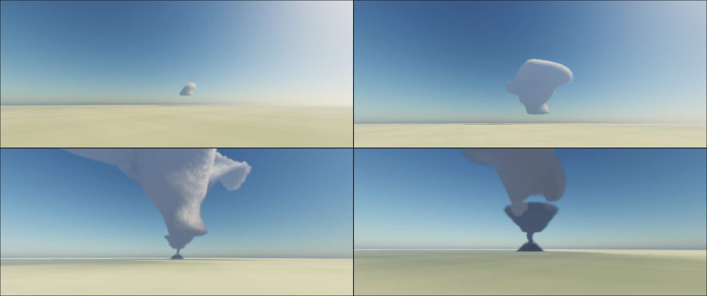
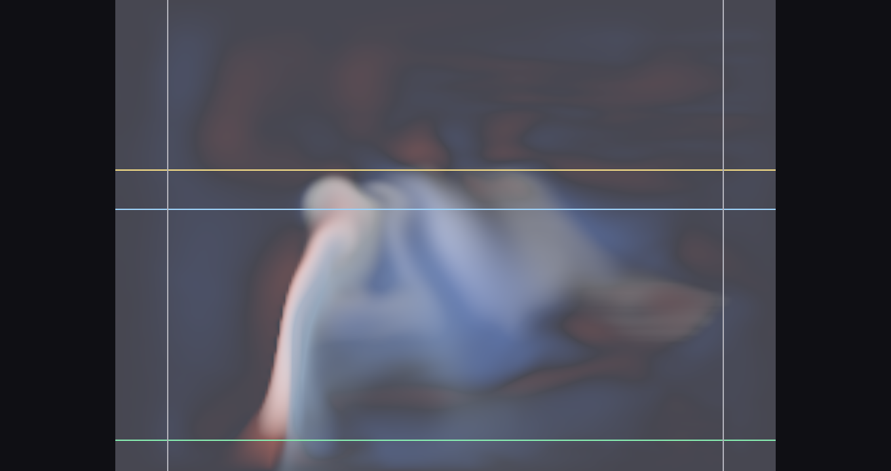
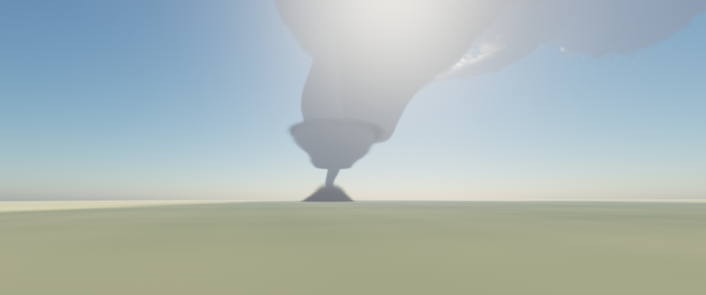

# Storm

A Windows screensaver that grows a cumulus into a cumulonimbus, tilts it into a
supercell, and drops a tornado out of it — with a different storm every run.

Direct3D 12, compute-shader volumetric rendering. Screensaver shell modelled on
[cmillsap/Juggler](https://github.com/cmillsap/Juggler).

**Status: version 1.0. All six phases are complete.** `Storm.scr` builds,
installs and runs. A flat-based cumulus becomes a congestus, the cap erodes, a
tilted cumulonimbus throws lightning and drops a rain shaft, a directed
mesocyclone lets it carry supercell shear, and a tornado comes down out of the
wall cloud — filmed by a camera that pushes in for it, with a different storm
every couple of minutes. The four validation spikes that preceded it are kept
under `spikes/`.



## Building and running

Requires Visual Studio 2022 with the C++ desktop workload and the Windows
10/11 SDK. No external SDK or package manager — `dxcompiler.dll` and `dxil.dll`
are copied out of the Windows SDK at build time.

```
build.bat                       Release build (or: build.bat Debug)
build\Release\Storm.scr /s      run full screen
build\Release\Storm.scr /c      settings
.\install.ps1                   install for the current user
.\install.ps1 -Uninstall        and remove it again
```

`install.ps1` copies `Storm.scr`, `dxcompiler.dll`, `dxil.dll` and the
`shaders` folder into `%LOCALAPPDATA%\Storm` and selects it as the screensaver.
Nothing goes outside the user's profile and nothing needs elevation — an
unsigned executable copying itself into System32 is the exact shape of
something malicious, which was on the risk register from the start. The four
pieces must stay together: the shaders are compiled at startup, not baked into
the executable.

**The binary is not signed**, so SmartScreen may warn the first time it runs.
Signing needs a code-signing certificate that this project does not have.

### Development switches

Windows never passes these, so they cannot collide with the screensaver
contract. A screensaver takes over the display, which makes it almost
impossible to inspect while developing; the spikes established that looking at
the image is the only way to catch a renderer that is fast and wrong.

| | |
|---|---|
| `/w` | Run in an ordinary window rather than full screen |
| `/capture <file.bmp> [w h] [seconds] [distance] [aim]` | Render one frame to disk |
| `/slice <file.bmp> [w h] [seconds]` | Draw the simulation fields on a vertical plane |
| `/arc [file.csv] [storm s] [interval] [EL m] [rotation] [shear]` | Run the storm headless and measure it |
| `/bench [file.txt] [w h] [frames] [warm-up s]` | Time the render pipeline |
| `/probe [file.txt]` | Report the monitor layout and the mirroring arithmetic |
| `/free` | Never reset the storm; watch what is left of it |
| `/forced[:n]` | As `/free`, but keep forcing the boundary layer so the sky works on |

`/arc` and `/slice` are Phase 03's, and between them they are why that phase
landed. `/arc` runs the solver with no window and no render passes and writes a
row per interval of storm time - cloud base and top, peak updraft and
downdraft, condensate and rain, cloud radius, and from Phase 04 the
updraft-vorticity correlation and peak vorticity - plus a second file giving
peak condensate and cloudy-cell count in each of 32 height bands. `/slice` draws the
fields themselves rather than the sky. Almost every wrong turn below was found
in one of those two and would not have been visible in a screenshot.

`/free` is a modifier rather than a mode, and goes after one: `Storm.scr /w /free`.
It stops the storm cycling and, once the arc has run out, swaps the camera from
the acts to a slow low orbit around the domain — the shot list's last keyframe
is 21 km out aimed at 5 km, which is the worst place to watch from when what
survives a storm is near the ground. Nothing is forced after the arc ends, so
what happens from then on is whatever the solver does with what the storm left
behind: on the shipped sounding that is about a minute of sheared outflow
remnants before they evaporate. `/forced` is what keeps it going.

`/forced` implies `/free` and adds one thing: after the arc has run out it
replays the arc's own forcing schedule, over and over, against whatever the
last storm left behind rather than against a fresh sounding. New cumulus grow
in the old storm's wake every couple of minutes. There is no mesocyclone and no
lid by then, so they are ordinary convection - congestus reaching four or five
kilometres, not supercells.

The optional number is a **multiple of the arc's peak forcing**, defaulting to
3.5, and it has to be a multiple rather than a fraction. A storm growing from
rest also gets a two-kelvin bubble handed to it in the initial condition, and a
rate has to exceed anything the arc asks for to stand in for one. Below about
2.0 nothing condenses at all: the thermals rise to the condensation level and
stop dead on it, which `/slice` shows very clearly.

`/capture`'s optional `distance` stands the camera that many metres off the
storm on its inflow side and re-aims it, instead of the shipped 18 km. It is
development only — the camera that ships is Phase 05's — but a tornado is two
degrees wide from 18 km, and there is no tuning something you cannot see.

Set **`STORM_QUIET`** in the environment when driving any of these from a
script. Fatal errors normally report through a message box, which is right when
Windows launches the screensaver and has no console to print to, and exactly
wrong for a script: a modal dialog nobody clicks leaves the process alive and
holding the GPU. With `STORM_QUIET` set the dialog is skipped; either way the
message is written to `storm-error.txt`.

`/capture` runs up to the requested moment at the real frame rate rather than
holding time still — with a frozen camera the temporal reprojection is an
identity transform and the capture would prove nothing about it.

Note that `.scr` files have a shell association whose default verb is *Install*,
so launching one from a script needs `UseShellExecute = false` or it will not
run the way you expect.

## Phase 00 — shell and skeleton

- **The `.scr` contract**: `/s` full screen, `/c` configure, `/p <hwnd>`
  preview, including the named-event handshake that lets a new instance evict a
  running preview before claiming its window.
- **Multi-monitor**, one borderless window and swap chain per display, sharing
  a single device, one simulation and one rendered frame.
- **The state/view split** that keeps mirroring a policy rather than an
  assumption — see `src/view.h`.
- **A real Rayleigh/Mie atmosphere** carried over from Spike 02, with the sun on
  a five-minute arc, rather than a placeholder gradient. Phase 01 adds a cloud
  march to this rather than replacing it.
- Frames capped at 30 fps; measured at roughly 6% of one CPU core.

## Phase 01 — volumetric raymarcher

The Spike 02 cumulus, at target resolution, temporally resolved.

- **Cloud march at half resolution**, fixed stepping, ~96 steps. Adaptive
  empty-space skipping is deliberately absent: Spike 01 measured it at 2.7×
  *slower* inside a bounded volume.
- **Sun transmittance from a precomputed 64³ volume**, rebuilt each frame, not
  a per-sample cone march. Spike 01 measured that swap at 2.28× faster with a
  maximum image error of 4/255. The same volume shadows the ground for free.
- **Temporal resolve** — the one part no spike built. The primary ray is
  jittered on a Halton sequence each frame and accumulated, so a cheap march
  still resolves clean. Reprojection goes through the world-space ray
  direction rather than a screen-space motion vector: the camera rotates
  without translating, which makes it exact and depth-independent, and a
  volumetric buffer has no single depth to reproject by anyway. Neighbourhood
  clamping keeps stale history from smearing.
- **Full-resolution composite** — sky, sun and ground stay sharp; only the
  cloud is half resolution, which it can afford to be.

**3.32 ms per frame at 3440×1440** on an RTX 5060 Ti — 10% of a 30 fps frame —
including the light volume rebuild, the march, the resolve and the composite.

Known limits: reprojection assumes the camera does not translate, which holds
until the camera system in Phase 05; it will need the cloud's mean distance
carried alongside the colour. Nothing in the cloud is simulated at this point —
the shape is the analytic container from Spike 02, which Phase 02 replaces.

## Phase 02 — GPU simulation

The container is gone. `sampleDensity` now reads condensate out of a fluid
solver, and the noise that used to *be* the cloud only erodes it.

- **A staggered-grid solver in compute**, ported from the CPU solvers of Spikes
  03 and 04: semi-Lagrangian advection, buoyancy with the virtual-temperature
  effect and condensate loading, saturation adjustment with latent heat, and a
  20-iteration Jacobi pressure projection. 128³ cells at 50 m — a 6.4 km cube.
  **No vorticity confinement**, per Spike 03.
- **The simulation keeps its own clock**, 20 steps a second at 1 s of storm
  time per step, decoupled from the display: a 144 Hz monitor does not cost 144
  fluid steps a second, and a 30 fps one does not slow the weather down.
- **The light volume rebuilds at simulation rate, not frame rate** — the
  amortisation the plan called for, now that there is something to amortise
  against. It is skipped entirely on frames where the solver did not step.
- **Density is condensate**, scaled against a reference and then eroded by the
  same Perlin–Worley and Worley noise Spike 02 tuned. The solver supplies the
  low-frequency shape; the noise supplies everything below the 50 m cell.

**4.83 ms per frame at 3440×1440** on an RTX 5060 Ti — 14% of a 30 fps frame —
including the simulation step, the light volume rebuild, the march, the resolve
and the composite. Adding the solver cost nothing measurable: it is the Phase
01 frame time within noise, because 20 steps a second spread across 30 frames
is two thirds of a step per frame.

### What it does on screen

Seeded from rest, it runs a cumulus life cycle without being told to, in about
two minutes:

| | |
|---|---|
| ~20 s | a flat-based humilis, one puff wide |
| ~28 s | congestus, cauliflower turrets sharing that base |
| ~36 s | the tower deepens and hardens |
| ~50 s | the top reaches the cap and starts to spread |
| ~65 s | spread top, ragged underside, the forcing now off |
| ~85 s | the crown breaks into fragments |
| ~110 s | dissipating |

### Three calibration findings

- **The sounding needed a mixed layer.** With one 4 K/km lapse rate all the way
  to the ground, a thermal has to be heated for several minutes of storm time
  before it can climb the few hundred metres to its condensation level, so the
  first cloud appeared only as the forcing was already decaying — it grew and
  died but never had a mature phase. A real boundary layer is mixed and very
  nearly neutral. Adding one, 600 m deep, is what turned a wisp into a cumulus.
- **Constant vapour in that layer is what makes the base flat.** "Well mixed"
  means every parcel carries the same vapour, so every parcel condenses at the
  same height. With relative humidity falling smoothly from the ground instead,
  each thermal gets its own condensation level and the base is a point rather
  than a plane. Spike 02 found the same thing from the other side: flatness
  comes from cutting condensation on sharply, not from shaping the cloud.
- **The source has to be a sheet, not a ball.** A spherical warm source rises
  as one mushroom, stem and cap, because that is what a spherical warm source
  does. Spreading the same heat over a 2 km wide, 400 m deep patch inside the
  mixed layer, with low-frequency noise across it so it is not axisymmetric,
  lifts a whole layer at once and gives several turrets over one base.

### Two bugs worth remembering

- **The light volume resolution was held in two places** and drifted: the host
  dispatched 96³ while the shader's constant still said 64, so two thirds of
  the volume was never written and the cloud top sampled uninitialised memory
  as full shadow. It showed up as a dark cap, and I first misdiagnosed it as
  the powder term and "fixed" it with a floor. The resolution now travels in
  the frame constants, and there is one source of truth.
- **The condensate reference is a two-sided error.** Set an order of magnitude
  low, every cell saturates to one, the erosion has no gradient to bite into
  and the cloud is a smooth blob. Set above what the solver actually produces,
  the erosion threshold sits above the density everywhere in the lower cloud
  and eats the flat base entirely, leaving one small puff high up. It has to be
  read off what the solver produces — just under the peak it reaches.

Known limits: it is one cell, in still air, with no shear and no rotation —
Phases 03 and 04 own the storm arc and the supercell. The underside reads grey
and slightly dead, and the sub-cloud stalk hangs lower than a real cumulus's
would.


## Phase 03 — the storm arc

The cumulus becomes a storm. One sounding vector describes the atmosphere, an
arc of three acts moves the lid that holds it down, and the solver does the
rest: shear tilts the tower, rain falls out of it and cools the air under it,
and lightning goes off inside.

- **The sounding is a vector, and it is the only place the atmosphere is
  described.** Every number the physics reads — lapse rates, humidity, the
  freezing and glaciation levels, the shear, the forcing, what counts as
  opaque — arrives from one struct. Nothing in the solver carries a tuned
  constant of its own, which is what Phase 05 needs in order to derive a
  different storm from a seed.
- **A domain a cumulonimbus fits in.** 224 × 160 × 160 at 90 m: 20.16 km along
  the shear, 14.4 km deep. Phase 02's 6.4 km cube was outgrown before its
  forcing had even decayed.
- **Three acts, separated by the cap.** A capping inversion of 5.5 K sits at
  2.6 km and holds the sky to a 200 m-deep fair-weather cumulus; it rises and
  weakens through the congestus act; by the mature act it is gone and the tower
  runs to the equilibrium level.
- **Shear, in the storm-relative frame.** 2 m/s per km through the lowest 6 km,
  anchored on the inflow layer so the forcing keeps feeding one column while
  the upper levels stream past it. The tower leans downstream and the outflow
  goes with it.
- **Rain as the fourth scalar channel**, which was there and unused:
  autoconversion, accretion, sedimentation at 8 m/s, and evaporation into
  unsaturated air. The evaporation is the point — it cools the air it falls
  through, and that is the downdraft.
- **Lightning** as a point light inside the cloud, scheduled on the display's
  clock rather than the storm's, with a three-stroke envelope.
- **Ice**, without which there is no anvil at all.

**8.96 ms per frame at 3440×1440** on an RTX 5060 Ti — 27% of a 30 fps frame —
measured on a mature storm rather than an empty sky, which is a change to the
benchmark this phase had to make. Phase 02's 4.83 ms bought 2.7× the cells,
2.7× the march steps and 2.4× the light volume, and two new passes.

### The arc, measured

`/arc` on the shipped sounding. Storm time; the display runs it twenty times
faster than real weather, so this is about 140 seconds on screen.

| storm time | cloud base | cloud top | peak updraft | condensate | rain |
|---|---|---|---|---|---|
| 400 s | 1035 m | 1665 m | 7.0 m/s | 1.8 | 0.0 |
| 600 s | 1035 m | 3465 m | 24.6 m/s | 28.3 | 2.7 |
| 800 s | 1035 m | 7605 m | 54.0 m/s | 115.9 | 26.0 |
| 1200 s | 1035 m | 9225 m | 49.5 m/s | 222.0 | 64.2 |
| 1600 s | 1035 m | 9765 m | 50.4 m/s | 175.1 | 71.1 |
| 2200 s | 1035 m | 9225 m | 39.5 m/s | 130.0 | 50.9 |
| 2800 s | 1125 m | 6075 m | 19.0 m/s | 21.6 | 16.7 |

The cloud base does not move: 1035 m for the whole life of the storm, one cell
off the 948 m the sounding predicts. The storm dies of its own rain.

### The cloud-top calibration curve

The plan asked for this rather than a direct mapping, and it was right to.
Cloud top against the prescribed equilibrium level, everything else held:

| prescribed EL | 5000 | 6500 | 8000 | 9500 | 10500 | 12000 |
|---|---|---|---|---|---|---|
| **cloud top** | 6975 | 8235 | 9135 | 9855 | 10125 | 9855 |
| **overshoot** | +1975 | +1735 | +1135 | +355 | −375 | −2145 |

Monotonic and directable to about 9.5 km, then flat. The flat part is the
useful half of the finding: above roughly 10 km the cap stops being what limits
the storm, because the parcel's own level of neutral buoyancy takes over. Put
the cap above that and it caps nothing — which is exactly what was happening
when the storm was topping out at 10.1 km with nothing spreading, because there
is no anvil without something for the outflow to spread under. The shipped
sounding puts the equilibrium level at 9200 m, under the neutral level, so the
storm arrives at the cap with about a kilometre of overshoot and has to go
sideways.

To place cloud top higher than about 10 km, the lapse rate or the moisture has
to change — not the cap.

### Six findings, all of them from the instruments



- **The lapse rate and the equilibrium level are not independent.** A parcel
  lifted out of the mixed layer gains 2488 K per unit of condensate; the
  environment gains its lapse rate per metre; where those cross is the parcel's
  neutral level. At 4.0 K/km that crossing is at 9.2 km, so a cap at 10.5 km
  was never reached and the plume spread at mid-level instead — 22,700 cloudy
  cells at 5.6 km against 2,700 at the cap. Lowering the lapse rate to 3.4 K/km
  moved the crossing above the cap and the storm stopped filling out sideways.
  This is the single most useful thing the phase learned about direction.
- **A glaciation level is not a freezing level.** Ice is what makes an anvil:
  detrained condensate meets air at 30% humidity and, under an instantaneous
  saturation adjustment, is gone in one step, which is why the first 11 km
  tower rendered as a bare column. But putting the ice transition at the 0 °C
  line makes everything above 4 km permanent, and the storm grows a pancake at
  5 to 6 km instead. Deep convection glaciates near −38 °C, around 8 km here.
- **Opacity has to be measured locally.** Phase 02 mapped condensate to opacity
  through one constant, which works while the cloud is a cumulus that is the
  only thing in the box. Across a 14 km storm it fails twice: peak condensate
  climbs from 0.0019 at the base to 0.0117 in the anvil, and at any one height
  the periphery carries a tenth of what the core does. Because the erosion that
  carves the silhouette is a *threshold*, a mismatched reference does not carve
  the anvil, it deletes every sample of it. The fix is a coarse volume holding
  peak condensate over each 4×4×4 block, rebuilt at simulation rate, and
  normalising against that — so every part of the cloud hands the erosion a
  field that reaches one inside and falls to zero at the edge.
- **Relaxing the environment is not free.** Clear air was being nudged back
  toward the sounding to let the cap move. But the forcing works by
  accumulating heat and moisture in clear air, so the relaxation was
  subtracting from the forcing every step: it cost the storm two kilometres of
  depth. Moving the environment *exactly* instead — adding the change in the
  profile to every cell's potential temperature, which leaves every parcel's
  departure from its surroundings untouched — made the term unnecessary. It is
  left in the sounding at zero because it is the kind of term that looks
  obviously right.
- **A lid should erode by weakening, not by rising.** A capping inversion that
  only rises is still several kelvin of extra warmth sitting exactly where the
  tower is trying to climb; the storm topped out at 8.9 km against the 11.0 km
  the same forcing reached with no lid at all.
- **The margin was eating the anvil.** The sides are periodic because the
  pressure solve wants them to be, so outflow that reaches one face returns
  through the other — measured, unmistakably, as a cloud radius that jumped to
  the box half-diagonal the moment the anvil arrived. A relaxation margin fixes
  it, but at 28% of the half-width it began absorbing 5.2 km from the storm
  axis across the shear, and mass continuity puts the anvil edge at about
  4 m/s once it is 5 km out. It never got past the margin.

### Two bugs worth remembering

- **One constant buffer cannot serve several simulation steps in a frame.** The
  CPU writes all of them before the GPU runs any, so every step in the frame
  reads whichever was written last. That was harmless while the only per-step
  value was a slowly varying forcing ramp, and stopped being harmless the
  moment the arc started moving the lid, because the environment shift is a
  *difference* between consecutive steps: three steps sharing a slot applied
  one difference three times and lost the other two. There is now a slot per
  step, plus slot zero for the render passes.
- **Rain evaporation must depend on how much rain there is.** Written as a rate
  per unit saturation deficit alone, the rate is the same for a downpour and
  for the last drop of it: a shaft of 0.002 emptied in one second of storm
  time, the rain never got below the cloud base, and the precipitation shaft
  the phase is supposed to ship was two cells deep.

Known limits: **the anvil is a downstream shelf rather than an incus.** The
storm reaches its cap, overshoots it and spreads, but the spread is a few
kilometres and the cloud is still widest in the middle rather than at the top.
Mass continuity says why — the outflow slows as it spreads, and a 20 km domain
does not give it long enough. A real anvil is tens of kilometres across and no
plausible domain will hold one, so the honest options are a wider box in
Phase 04 or an art-directed extension at render time, which is what the plan
already assumes for the hook and the RFD clear slot. There is also no rotation:
at 3.5 m/s per km of shear the tower tilted hard and came apart, cloud top
falling from 12.0 km to 7.0 km, which is Spike 04's finding arriving on
schedule. Phase 03 ships the 2 m/s per km the storm survives without help;
Phase 04 raises it once the mesocyclone is there to hold it together.


## Phase 04 — supercell and tornado

The storm rotates, and something comes out of the bottom of it. Rotation is
directed rather than waited for, steered on the one number Spike 04 said to
steer on; the shear goes up to a real supercell value because the rotation is
what pays for it; and the funnel, the wall cloud, the debris cloud and the
rear-flank clear slot are authored, because the spike measured that imposed
swirl produces none of them.



- **Directed rotation**, as a target swirl about the storm's axis with only the
  *tangential* component steered — so the inflow and outflow through the same
  region are left alone. Rankine profile, 1.8 km core, on an axis that leans
  downstream with the tower.
- **Steered on the updraft–vorticity correlation.** The `/arc` harness now
  reduces the Pearson correlation between vertical velocity and vertical
  vorticity through the storm layer, and reports peak vorticity beside it
  precisely because that is the number *not* to use.
- **4.0 m/s per km of shear**, twice what Phase 03 could carry.
- **An analytic funnel**, with a wall cloud above it and a debris cloud where
  it meets the ground, on a life cycle that descends, holds and ropes out.
- **The RFD clear slot and the vault**, authored, without which the tornado
  hangs inside opaque precipitation and cannot be seen at all.
- **Mammatus**, as a displacement of the sample coordinate inside the ice.
- **Rain given its own optics**, which turned out to matter more than anything
  else in this list.

**11.57 ms per frame at 3440×1440** on an RTX 5060 Ti — 35% of a 30 fps frame,
measured on a mature storm. Phase 03's 8.96 ms bought the funnel, the clear
slot, the mammatus displacement and a considerably larger storm.

### What the rotation buys

This is the whole argument of the phase, and it is Spike 04's claim reproduced
in the production solver. Cloud top and peak updraft against the 0–6 km shear,
with the mesocyclone off and on:

| 0–6 km shear | 2.0 | 3.0 | 4.0 | 5.0 m/s/km |
|---|---|---|---|---|
| **cloud top, no rotation** | 9765 | 8775 | 8235 | 6885 m |
| **cloud top, rotating** | 11475 | 11385 | 11205 | 10665 m |
| **peak updraft, no rotation** | 54.0 | 43.5 | 41.5 | 33.1 m/s |
| **peak updraft, rotating** | 64.6 | 63.7 | 58.2 | 52.5 m/s |

Unrotated, the storm loses 30% of its depth and 39% of its updraft across that
range — which is exactly why Phase 03 shipped 2.0 m/s/km and said so. Rotating,
it loses 7% and 19%. The shipped sounding takes the shear to 4.0.

### Steering on the correlation

Rotation asked for, against what arrives:

| target swirl | 0 | 10 | 20 | 30 | 40 m/s |
|---|---|---|---|---|---|
| **w–ζ correlation** | 0.01 | 0.10 | 0.36 | 0.62 | 0.51 |
| **peak vorticity** | 0.085 | 0.054 | 0.044 | 0.049 | 0.061 s⁻¹ |
| **cloud top** | 9765 | 11295 | 11475 | 11565 | 11565 m |

The correlation is monotonic and directable up to 30 m/s and then saturates —
close to the spike's 0.28 → 0.79 → 0.84. **Peak vorticity is not monotonic in
anything**, and at zero rotation it is at its highest: with no mesocyclone at
all the largest vorticity in the domain is 0.085 s⁻¹ of small-scale shear.
Steering on it would have driven the rotation in exactly the wrong direction,
which is what Spike 04 was warning about.

### Six findings

- **The sign of the rotation is not a coin toss.** Vertical vorticity here is
  ζ = ∂u/∂z − ∂w/∂x, so solid-body rotation about +y — counter-clockwise seen
  from above, which is what a Northern Hemisphere supercell does — has velocity
  along (dz, −dx). Written the other way the storm is anticyclonic, and the
  correlation runs monotonically *negative*: the magnitude tracked the rotation
  asked for perfectly while the sign was upside down, which is how it was
  caught and would never have been caught by looking.
- **Confining the swirl is geometry, and gating it on cloud is worse than the
  disease.** A 2.6 km core faded out to 8.8 km covers most of the domain, and a
  rotating column that wide drags a broad layer up under it: 1.5 million cloudy
  cells out of 5.7 million. The obvious repair — only rotate where there is
  already cloud — leaves the swirl unable to organise the inflow that feeds the
  storm, and all it then does is shred what it is applied to: the correlation
  stalled at 0.21, peak vorticity climbed as the small scales tore up, and
  cloud top *fell* from 10.8 km to 8.4 km as the rotation was raised. A
  mesocyclone is two to four kilometres across; confining it to that is all it
  needs.
- **Rain has to be optically thin, and this was the single largest improvement
  in the phase.** Extinction goes as total cross-section, which for fixed mass
  goes as 1/radius — a millimetre raindrop is a hundred times a cloud droplet,
  so the same water as rain blocks a small fraction of what it blocks as cloud.
  Treating them alike made the storm's lower half an opaque wall for kilometres
  in every direction; from 4 km away the view was a flat grey field with the
  tornado somewhere inside it. It is also what made the storm read as a dark
  mass rather than as a cumulonimbus.
- **The clear slot has to exist, and it has to not delete the tornado.** With
  the vault authored, the air under the mesocyclone has no cloud and no rain —
  so `sampleDensityAndRain` took its "nothing here" early-out and returned
  before the funnel was folded in. The tornado rendered as a two-hundred-metre
  stub of wall cloud with nothing below it, in the one place it was guaranteed
  to be invisible. Every early-out in that function now lets the funnel past.
- **A rotating updraft sustains itself on much less forcing.** The forcing
  radius came down from 1800 m to 1200 m and the heating with it, and the storm
  is deeper than before. That is what makes the anvil read: an anvil only looks
  like an anvil when it is wider than the tower feeding it, the domain caps how
  wide the anvil can get, so the tower is what has to give.
- **The anvil arrived as a side effect.** Phase 03 could not get the cloud's
  widest point up to the cap and said so. With the mesocyclone directed, the
  band profile puts the maximum at 8.3–9.2 km, immediately under the 9.2 km
  equilibrium level — the shape Phase 03 was reaching for, produced by
  something that was not aimed at it.

### Two bugs worth remembering

- **A modal dialog with nobody to click it holds the GPU.** `FailHard` reports
  through a message box, which is right when Windows launches the screensaver
  and there is no console. Run from a script it is exactly wrong: a shader
  compile error left a process alive and holding the device, a second one
  joined it, and for the better part of an hour every capture and benchmark
  after that was contending with two stuck processes — captures that should
  take 17 seconds took over ten minutes, then failed, inconsistently. The
  underlying error was one undeclared identifier. Fatal errors now also write
  `storm-error.txt`, and `STORM_QUIET` suppresses the dialog for anything
  headless. Worth the embarrassment: the symptom looked exactly like a
  performance cliff, and was diagnosed as one twice.
- **Fixed-point sums must round, not truncate.** The correlation is built from
  raw moments accumulated through `InterlockedAdd`, and every term is a `uint`
  cast that rounds toward zero — so each of 300,000 cells lost up to a whole
  unit in the same direction. The bias buried the moments completely and the
  first reading was a Pearson correlation of −23.2, which is not a value a
  correlation can take. Adding a half before the cast makes the error
  zero-mean; sampling every fourth cell rather than every second leaves the
  headroom to make the units small enough that what remains is noise.

Known limits: **the tornado is only properly legible from close to.** It is
680 m across, which from the shipped camera's 18 km is two degrees — honest,
and too small to be the subject of a screensaver. It reads at that distance as
a dark thread with a debris cloud, and the image above is from four kilometres
through the development camera override. The camera that pushes in for the
tornado act is Phase 05's, and this is now the strongest argument for it. The
debris cloud is also smoother than dust should be, there is no hook echo in the
precipitation field — the clear slot is carved out of the rain rather than the
rain being wrapped into a hook — and the anvil is still limited by the domain
width in the way Phase 03 described.


## Phase 05 — direction and ship

The camera flies, the storm is different every time, and the whole thing
installs. This is the phase where the parts stop being a demo of a solver and
start being a screensaver.


- **A camera spline over the acts.** Shots are cylindrical — a distance from
  the storm's axis, an azimuth around it, a height, and a height on the axis to
  look at — interpolated with Catmull-Rom. It opens far off and low, closes as
  the congestus builds, backs away to hold the anvil, then swings round to the
  inflow side and pushes in as the funnel comes down.
- **Reprojection that survives a translating camera**, which the plan flagged
  as owed back in Phase 01 and which the camera above made unavoidable.
- **A different storm every couple of minutes**, derived from a seed by
  perturbing the sounding vector — the only route Spike 03 left open.
- **Settings in the registry**, behind a real dialog on `/c`: quality, frame
  rate, whether to cycle storms, when to stop drawing, and whether to back off
  on battery.
- **Adaptive quality** on a smoothed frame time with hysteresis, and a cheap
  path for the `/p` preview thumbnail.
- **A per-user installer** that does not go anywhere near System32.

**10.9 ms per frame at 3440×1440 in the wide shots, rising to 16.6 ms with the
camera in close on the tornado** — 33% to 50% of a 30 fps frame on an RTX
5060 Ti. The close shots cost more for the obvious reason: the camera is inside
the storm's own scale, and every ray crosses far more cloud.

| act | camera | frame |
|---|---|---|
| the cumulus appears | 19 km | 10.9 ms |
| congestus | 15 km | 11.5 ms |
| the anvil spreads | 17 km | 13.0 ms |
| the tornado is down | 4 km | 16.6 ms |

### The camera's bill, paid at last

Phase 01 wrote a note against the temporal resolve: *once the camera starts
translating, reprojection needs the cloud's mean distance carried alongside the
colour.* For four phases the camera only rotated, which makes reprojection
exact and independent of depth. Phase 05 flies it, so the bill came due.

The march already computed what was needed — the transmittance-weighted mean
distance along each ray, used for aerial perspective — and had been throwing it
away. Keeping it in a half-resolution R32F buffer and reprojecting through the
world point rather than the world direction is the whole change. R32F rather
than R16F because this is a distance in metres out to twenty-odd kilometres,
and half-float steps to 16 m at that range, which shows as banded reprojection
exactly when the camera is moving fastest.

### What the new camera angles exposed

Flying the camera did not break the renderer, but it did find something four
phases of a fixed viewpoint never could. The first shot that looked along the
anvil rather than at it came back with the cloud's upper surface **combed with
fine regular striations**, about nine pixels apart.

Nine pixels at that range is 157 m, which is exactly one cell of the light
volume. The transmittance volume is coarse and its trilinear interpolation is
smooth but piecewise; on a surface facing the camera that is invisible, and on
one nearly tangent to the view it is not, because a small step across the
screen crosses many cells. The fixed camera had simply never looked at the
storm from an angle that produced a tangent surface.

Raising the volume to 192³ removes it and costs 3.4× the light volume to build.
Dithering the lookup by up to one cell, per pixel and per frame, removes it just
as well and costs one hash: what was a static band becomes noise, and the
temporal resolve was already there to average noise away. The dithered 128³ is
what ships, and it reads as cloud texture rather than as a fix.

### Variety, and where it comes from

Spike 03 measured cloud top varying by 0.4% across four noise seeds — every
seed makes the same storm — while the sounding controls it monotonically. So
the seed moves the atmosphere and never the noise:

| what the seed moves | range |
|---|---|
| surface humidity | ±0.03 — the cloud base, ±150 m |
| tropospheric lapse rate | ±0.16 K/km — how deep it gets |
| equilibrium level | ±700 m — where the anvil sits |
| shear, and rotation with it | 3.3–4.7 m/s/km, 19–28 m/s |
| forcing radius | ±220 m — how much of the frame it fills |
| tornado onset, hold, descent | 300–620 s on the ground |

Shear and rotation move together deliberately: Phase 04 measured that shear
without rotation tears the storm apart, so a seed that asks for a more sheared
storm has to ask for a stronger mesocyclone in the same breath.

### Two bugs worth remembering

- **`DLGITEMTEMPLATEEX` does not begin the way `DLGITEMTEMPLATE` does.** The
  extended form starts with a help id, then extended style, then style; the
  plain one starts with style. Writing the plain layout into an extended
  template produces something Windows rejects outright — `DialogBoxIndirectParam`
  returns −1 and `GetLastError` returns 0, which is a singularly unhelpful way
  to be told that a 300-byte buffer has one field in the wrong place.
- **The `.scr` shell association caught me in my own harness.** The README has
  warned since Phase 00 that launching a `.scr` from a script needs
  `UseShellExecute = false`, because the default verb is *Install*. Testing the
  settings dialog I omitted `-NoNewWindow`, PowerShell used ShellExecute, the
  shell ran the screensaver full-screen instead, and I spent a while concluding
  the dialog template was malformed from a window that was not the dialog. The
  template *was* malformed, which is the part that made it convincing.

### Shipping

`install.ps1` installs per-user into `%LOCALAPPDATA%\Storm` and points the
registry at it. Nothing is written outside the user's profile and no elevation
is asked for, which is deliberate: an unsigned executable copying itself into
System32 is the exact shape of something malicious, and that was on the risk
register from the start. `-Uninstall` reverses it, and leaves the settings
alone so that reinstalling does not forget them.

**The binary is not signed.** Signing needs a code-signing certificate, which
this project does not have, so SmartScreen will warn the first time it runs.
That is the one item on the plan's Phase 05 list that is not done, and it is
not done for want of a certificate rather than for want of the work.

Known limits: **the sky is empty for about the first fifteen seconds of each
storm**, because the solver has to grow a cumulus from rest and there is no way
to start it partway. With storms cycling every two and a half minutes that is
about a tenth of the time, at the moment nobody is watching. The **multi-monitor
path has still only ever run on one physical display** — the handshake, the
per-monitor swap chains and the crop-to-fill arithmetic are all built and
`/probe` reports what they would do, but they are verified on paper. And the
adaptive quality has only been exercised by forcing tiers by hand; the machine
it was written on never drops below the top one.


## Spikes

Four spikes were run before committing to the build, each retiring a specific
assumption.

| | Spike | Question | Status |
|---|---|---|---|
| 01 | [Performance](spikes/01-perf) | What does a raymarch step actually cost? | **Done** — budget holds; see findings |
| 02 | [Look](spikes/02-look) | Can one beautiful still frame of cumulus be reached in a day or two of tuning? | **Done** — yes, in about two hours |
| 03 | [Controllability](spikes/03-control) | Does forced buoyancy go where it is told, and does a stability layer spread an anvil? | **Done** — yes; but drop vorticity confinement |
| 04 | [Mesocyclone](spikes/04-mesocyclone) | Does a rotating updraft survive shear in 3D, where the 2D storm tore apart? | **Done** — yes, when the rotation is directed |


### Spike 01 headlines

- The production-shaped shader costs **4.81 ms** at 1720×720 on an RTX 5060 Ti
  (6.69 ms on a 3060), against a plan estimate of 3–8 ms. Budget confirmed.
- **Texture fetches are nearly free.** Per-step cost is the same whether a step
  does zero, one or two 3D samples — the loop and ALU dominate.
- **The sun light march was ~60% of the frame — now solved.** Precomputing
  transmittance into a 64×48×64 volume at simulation rate is **2.28× faster**
  and drops lighting to 9% of the raymarch, for a maximum image error of 4/255.
- **Cheap/expensive adaptive stepping made things 2.7× slower.** Empty-space
  skipping needs a real acceleration structure, and needs measuring.
- **Half-resolution rendering is mandatory** — a full-frame storm at native
  3440×1440 costs 34.75 ms, over a 30 fps budget before the simulation runs.

### Spike 02 headlines

- **The art-direction risk is retired.** A convincing cumulus congestus took
  about eight iterations, not the weeks the plan budgeted for.
- **The pretty version is the fast version**: 1.8 ms at 1720×720 including a
  full per-pixel Rayleigh/Mie atmosphere and a light-volume rebuild.
- **A real atmosphere carried more of the image than anything else** — one
  scattering integral shared by sky, aerial perspective and ground.
- **The cloud base must stay wide.** Flatness comes from cutting condensation
  on sharply at the LCL, not from tapering the shape; tapering rounds it into a
  balloon.
- Two bugs worth remembering: the ground has to be the planet sphere, and
  atmosphere samples must cluster toward the camera or the sky darkens toward
  the horizon instead of hazing.

Full write-up: [spikes/02-look/README.md](spikes/02-look/README.md).

### Spike 03 headlines

- **Directed simulation works.** Told to put the tower at 5, 10 or 15 km, it
  lands within 10, 17 and 6 m — sub-cell on a 78 m grid — with no drift.
- **The cap and the anvil are directable.** Cloud top tracks the prescribed
  tropopause monotonically, and the anvil spreads only once the top is capped.
- **Every seed makes a storm** (cloud top spread 0.4%). Variety therefore has
  to come from perturbing the sounding vector, not the noise seed.
- **Remove vorticity confinement from the pipeline.** It convects a stable
  atmosphere out of nothing (29.9 m/s from a standing start) and destroys
  placement control. Render-time detail noise supplies the billowing instead.
- **2D cannot validate shear → supercell.** Tilt is controllable to moderate
  shear, then the storm tears apart, because a 2D slice has no mechanism for
  the rotating updraft that sustains a real supercell. Act IV needs its own 3D
  spike before Phase 04.

Full write-up: [spikes/03-control/README.md](spikes/03-control/README.md).

### Spike 04 headlines

- **The 3D storm survives shear that killed the 2D one.** Cloud top declines
  13% across 0–5.3 m/s/km and the updraft stays strong; in 2D it collapsed from
  12.8 km to 9.2 km. Act IV is supported.
- **Rotation keeps the updraft alive.** With the forcing ramped off, a rotating
  updraft is still running at 66.8 m/s where a non-rotating one has fallen to
  37.8 m/s, and cloud top is 2 km higher.
- **The mesocyclone is directable.** The w–ζ correlation rises monotonically
  with the rotation asked for (0.28 → 0.79 → 0.84). Steer on that correlation,
  **not** on peak vorticity, which is non-monotonic and picks up unrelated
  small-scale shear.
- **Rotation does not emerge from the hodograph** at this resolution — direct
  it, as the plan already intends.
- **Imposed swirl does not produce the asymmetric structure.** The hook, the
  RFD clear slot and the displaced rain shaft must be art-directed, which is
  what the acceptance checklist already assumes.
- **Fully deterministic** — four seeds gave bit-identical storms. Variety has
  to come from the sounding vector.

Full write-up: [spikes/04-mesocyclone/README.md](spikes/04-mesocyclone/README.md).

### Where the renderer should start

Fixed stepping plus a precomputed light volume, at half resolution: roughly
**0.93 ms** for the cloud pass, and under 2 ms with the atmosphere on top.
Adopt adaptive stepping or an occupancy structure only when one is measured to
beat that.

Full write-up, including the four scene-setup errors that made the first
benchmark meaningless: [spikes/01-perf/README.md](spikes/01-perf/README.md).

## Layout

```
src/                     the screensaver itself
  main.cpp               entry point, .scr argument contract, instance handshake
  app.h/.cpp             monitor enumeration, windows, input, frame loop
  view.h/.cpp            one output: window, swap chain, crop-to-fill
  renderer.h/.cpp        shared render target and the passes over it
  director.h/.cpp        the camera spline and the acts it films
  settings.h/.cpp        registry-backed settings and the /c dialog
  simulation.h/.cpp      the fluid solver: resources, stepping, the sounding
  slots.h                descriptor table layout, shared by renderer and simulation
  gpu.h/.cpp             D3D12 device, descriptor heaps, runtime shader compilation
shaders/
  common.hlsli           frame constants and bindings, included everywhere
  atmosphere.hlsli       Rayleigh/Mie scattering, shared by sky and aerial perspective
  clouds.hlsli           cloud density, shape and lighting; the tornado,
                         the wall cloud and the rear-flank clear slot
  sim.hlsli              the staggered grid, the sounding, and how to sample both
  sim.hlsl               advect, force, buoyancy, condense, precipitate,
                         rotate, damp, project, and the /arc diagnostics
  noise_gen.hlsl         tileable Perlin-Worley and Worley volumes
  cloud.hlsl             light volume build and the cloud march
  resolve.hlsl           temporal reprojection and accumulation
  composite.hlsl         full-resolution sky, ground and cloud composite
  slice.hlsl             the fields on a vertical plane, for /slice
  blit.hlsl              presentation blit with the crop rectangle

spikes/01-perf/          what a raymarch step costs
  src/main.cpp           D3D12 host, benchmark driver, BMP capture
  shaders/
    noise_gen.hlsl       tileable Perlin-Worley and Worley volumes
    raymarch.hlsl        the instrumented cloud march
    blit.hlsl            fullscreen presentation

spikes/02-look/          whether it can be made beautiful
  src/main.cpp           D3D12 host, look-tuning flags, BMP capture
  shaders/
    atmosphere.hlsli     Rayleigh/Mie scattering, shared by sky and aerial perspective
    cloud.hlsl           density, lighting, light volume, ground, tonemap
    noise_gen.hlsl       as above
    blit.hlsl            as above
  docs/                  the resulting frame

spikes/03-control/       whether the simulation can be directed
  src/main.cpp           2D MAC-grid solver, experiment suite, filmstrip
  docs/                  the storm life cycle

spikes/04-mesocyclone/   whether a rotating updraft survives shear in 3D
  src/main.cpp           3D MAC-grid solver (OpenMP), experiment suite, filmstrip
  docs/                  the mesocyclone
```

Each spike builds with its own `build.bat` — one translation unit through
`cl.exe`, no project file.

## Requirements

Windows 10 1909+, a Direct3D 12 GPU, Visual Studio 2022 with the C++ desktop
workload, and the Windows 10/11 SDK. No external SDK or package manager —
`dxcompiler.dll` and `dxil.dll` are copied from the Windows SDK at build time.
