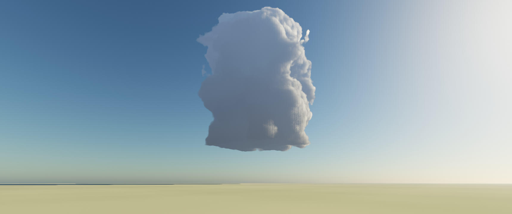

# Spike 02 — Can a frame of cumulus be made to look good?

The feasibility plan named art direction, not performance, as the real risk:

> A raymarched density field will happily produce grey mush. **The look spike:**
> a single beautiful still frame of one cumulus. If this is achievable in a day
> or two of tuning, the project is safe.

**Verdict: achievable, and faster than budgeted — roughly eight iterations over
a couple of hours.** And the frame that came out costs 1.8 ms, so the pretty
version and the fast version turn out to be the same version.



---

## Build and run

```
build.bat
build\spike02.exe                       # interactive
build\spike02.exe --capture out.bmp     # one frame to disk
build\spike02.exe --time                # 40 frames, wall-clock average
```

Every constant that only affects the look lives at the top of `cloud.hlsl`, and
shaders compile at startup — most iterations need no rebuild. The parameters
worth sweeping from outside are flags:

| Flag | |
|---|---|
| `--sun-elev D` `--sun-azim D` | Sun angle. Azimuth 0 is directly behind the cloud. |
| `--coverage F` `--density F` | How much cloud, and how optically thick. |
| `--exposure F` `--sun-power F` | Tonemapping. |
| `--cloud-base/-top/-radius/-z` | Cloud geometry, metres. |
| `--pitch F` `--fov D` | Camera. |
| `--steps N` `--width N` `--height N` | Quality. |

The frame above:

```
--exposure 0.5 --sun-elev 26 --sun-azim 65 --pitch 0.33 --fov 52
--cloud-z 7000 --cloud-top 6600 --steps 192
```

## Cost

RTX 5060 Ti, 1720×720, wall clock around a fully synchronised frame — an upper
bound including the 64³ light-volume rebuild and the present.

| | ms |
|---|---:|
| 192 steps (the frame above) | **1.8** |
| 96 steps | 1.4 |

Doubling the cloud steps costs only 0.4 ms, so the cloud march is roughly
0.8 ms and the atmosphere and ground make up the rest. **The per-pixel
Rayleigh/Mie integral is affordable without a lookup table** at this resolution
— 24 view samples × 8 light samples, evaluated up to three times per pixel, for
about 1 ms. A LUT is still the right move at 4K, but it is not load-bearing.

---

## What actually made the difference

Ordered by how much each one moved the image.

### 1. A real atmosphere, not a gradient

Single-scattering Rayleigh + Mie, with the *same* integral used for the sky, for
aerial perspective on the cloud, and for the ground. This is what supplies
horizon warming, the correct blue falloff with altitude, sun glow, and distance
haze — all of it consistent, because it is one model rather than three tuned
approximations that disagree with each other.

### 2. The base must stay wide; flatness comes from the cut

My first container profile narrowed toward `h = 0`, which rounded the underside
into a balloon. A cumulus base is *wide* and flat — the flatness comes from
switching condensation on over a few tens of metres at the lifting condensation
level, not from tapering the shape. Widening the profile at the base and cutting
it with a hard `smoothstep` was the single biggest realism gain.

### 3. Flat is not machined

A perfectly planar base reads as sliced with a knife. Undulating the
condensation level by a few percent of the cloud depth, using a low-frequency
noise lookup, keeps the edge sharp while making it look weathered.

### 4. Multiple-scattering octaves

Carried over from Spike 01 and still true: single scattering alone leaves cloud
interiors black, because direct sun transmittance through a few hundred metres
of dense cloud is essentially zero. Three octaves of progressively weakened
extinction are what let light bleed through the body.

### 5. Ground bounce, but only a little

Sunlit ground throwing warm light onto the cloud base is real and worth having.
At full strength it is a disaster — my first attempt set it around 5× the sky
ambient and flooded the shadow side, flattening the cloud into a pale blob. At
roughly a third of the sky ambient it warms the underside without touching the
tonal separation that gives the cloud its form.

---

## Two bugs worth recording

**The ground has to be the planet.** A flat plane extended to the horizon dives
underneath the spherical atmosphere; those samples clamp to sea-level density
and produce a dark band. Intersecting the sphere also puts the horizon at the
physically correct distance — about 23 km from 40 m up.

**Uniform sampling makes the sky darken toward the horizon.** A horizon ray
crosses a couple of hundred kilometres of atmosphere. Spacing 16 samples
uniformly puts them ~12 km apart through the densest, most strongly scattering
air directly in front of the viewer, and the in-scattering integral under-reports
so badly that the horizon goes *dark* instead of hazy. Distributing samples
quadratically, clustered toward the camera, fixes it outright.

That second one cost the most time, and not because it was hard. It produced a
dark band near the horizon which I confidently attributed first to a
ground/sky discontinuity, then to the cloud's own shadow — writing a fix for
each. Both were wrong. Printing the actual pixel values down a column across the
band identified it in one step: the sky was getting *darker* toward the horizon,
which is backwards, and the "band" was distant ground blending into that bad
sky. **Same lesson as Spike 01: measure the image, do not reason about it.**

---

## What this does not establish

- **One cloud, one lighting setup.** A congestus at a 26° sun is not a
  cumulonimbus, an anvil, a rain shaft, or a tornado. The genus-specific
  features on the plan's acceptance checklist remain unproven.
- **Nothing moves.** This is a still. Temporal coherence, the light volume
  rebuilt at simulation rate, and detail that advects with the flow instead of
  swimming through it are all untested.
- **The ground is a featureless plane.** Fine as a scale reference, but it is
  not landscape.
- A faint dark line still survives at the horizon on the anti-sun side, much
  reduced but not gone.
- The cloud body could use more internal crevice definition; the silhouette
  reads slightly columnar rather than bulging.

None of these are blockers. They are the next day of tuning, not a different
project.
