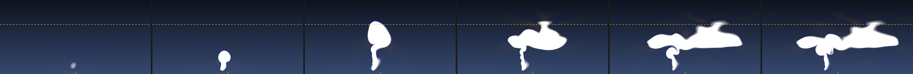

# Spike 03 — Can the simulation be told what to do?

The plan's central architectural bet is **directed simulation**: a coarse fluid
solver supplies motion and texture, but never decides what happens. An analytic
skeleton injects buoyancy where the story wants the tower, an ambient stability
profile spreads the anvil at the right altitude, and a shear profile tilts the
updraft. If the solver ignores that direction — or produces a storm only
sometimes — Phase 03 has no foundation.

**Verdict: the bet holds. Placement is accurate to a fraction of a cell, the
cap and the anvil respond monotonically, and every seed makes a storm.** With
one honest limitation: 2D cannot validate the shear-to-supercell mechanism, and
one significant finding: **vorticity confinement has to be removed.**



*Left to right: 300 s, 600 s, 900 s, 1400 s, 2000 s, 2700 s. Dashed line is the
prescribed tropopause; green tick marks the column the forcing was told to use.
Cloud water in white, buoyant air tinted warm.*

---

## Method

A 2D vertical slice on a staggered (MAC) grid, on the CPU — 384 × 192 cells at
78 m, so 30 km wide by 15 km tall, stepped at 2 s. Semi-Lagrangian advection,
buoyancy from virtual temperature with condensate loading, saturation
adjustment with latent heat release, precipitation fallout, a Jacobi pressure
projection, and a sponge layer under the lid.

Two dimensions is enough to answer the question and far easier to debug. Keeping
it off the GPU was deliberate: Spikes 01 and 02 already validated the D3D12
compute plumbing, so putting this on the GPU would only have risked a plumbing
bug masquerading as a physics result.

```
build.bat
build\spike03.exe --all              # the full experiment suite
build\spike03.exe --demo             # one run, evolution table
build\spike03.exe --film out.bmp     # the filmstrip above
```

---

## Results

### A. The tower goes exactly where it is told

| Asked for | Low-level centroid | Error |
|---:|---:|---:|
| 5 000 m | 5 010 m | **+10 m** |
| 10 000 m | 10 017 m | **+17 m** |
| 15 000 m | 15 006 m | **+6 m** |

Sub-cell accuracy on a 78 m grid. And it does not drift: the same error measured
at 600 s, 1200 s and 1800 s is +1 m, +0 m, +6 m.

### B. The stability layer sets the cloud top

| Tropopause | Cloud top | Overshoot | Anvil width |
|---:|---:|---:|---:|
| 7 000 m | 10 647 m | 3 647 m | 19 578 m |
| 9 000 m | 12 285 m | 3 285 m | 15 132 m |
| 11 000 m | 13 065 m | 2 065 m | 8 346 m |
| 12 500 m | 13 299 m | 799 m | 3 276 m |

Monotonic, and the overshoot shrinks as the cap rises — a parcel reaching a
higher equilibrium level has already spent most of its buoyancy getting there.
The mapping is not 1:1, so cloud top has to be **calibrated** against the
prescribed level rather than set directly. That is fine for art direction; it is
a lookup, not a search.

### C. The anvil spreads once the top is capped

| Time | Cloud top | Anvil width | Tower width | Aspect |
|---:|---:|---:|---:|---:|
| 300 s | 2 457 m | — | 1 326 m | — |
| 600 s | 5 343 m | — | 2 418 m | — |
| 900 s | 12 363 m | 3 978 m | 1 638 m | 2.43 |
| 1 200 s | 12 831 m | 6 006 m | 936 m | 6.42 |
| 1 500 s | 12 831 m | 6 864 m | 1 326 m | 5.18 |

No anvil at all until the tower reaches the cap, then lateral spreading while
the tower itself narrows. Exactly the behaviour Act III of the arc needs.

### D. Every seed makes a storm

Six seeds, identical sounding:

| | mean | spread |
|---|---:|---:|
| Cloud top | 12 844 m | 54 m (**0.4%**) |
| Anvil width | 8 125 m | 350 m (**4.3%**) |

None failed to produce a storm. That directly answers the plan's requirement —
*a screensaver that sometimes produces a storm is a failed screensaver.*

It also settles where variety has to come from. Perturbing the noise seed
changes almost nothing, because the sounding dominates. **Randomness must be
applied to the sounding vector**, not to the initial noise — which is precisely
what the plan already specifies.

### E. It is numerically stable

900 steps, no divergence, peak updraft 56 m/s, worst CFL 1.94 (legal for
semi-Lagrangian advection), and **0.06 K RMS** temperature departure far from
the storm.

---

## The finding that changes the plan: remove vorticity confinement

The plan lists vorticity confinement as a simulation pass, to supply billowing.
It has to come out.

Running a **quiescent atmosphere** — no forcing, no trigger bubble, nothing —
and measuring what the solver does on its own:

| Confinement | Theta noise | Peak speed | Condensate |
|---|---:|---:|---:|
| eps 0.00 | **0.000 K** | **0.00 m/s** | 0.000 |
| eps 0.02 | 0.000 K | 0.00 m/s | 0.000 |
| eps 0.06 | 0.000 K | 0.00 m/s | 0.000 |
| eps 0.12 | 1.318 K | **29.90 m/s** | 0.127 |

At eps 0.12 the scheme convects a statically stable atmosphere out of nothing,
and even condenses cloud. The solver itself is spotless — with confinement off,
a quiet atmosphere stays *exactly* quiet.

It also destroyed placement control. With confinement on, the storm drifted off
its column by an amount that grew with run time (−324 m at 600 s, −1047 m at
1200 s, −1415 m at 1800 s), and the error persisted at every setting:

| eps | 0.00 | 0.02 | 0.06 | 0.12 |
|---|---:|---:|---:|---:|
| Placement error | **+6 m** | −247 m | −451 m | −745 m |

There were two separate problems here, and finding the first hid the second:

1. **A real indexing bug.** The confinement force is computed at cell centres
   but applied to face-centred velocities. Applying it directly offsets it by
   half a cell in both directions, which does not average out — it biases the
   flow one way. Interpolating to the faces fixed that, and improved the
   numbers, but did not cure them.
2. **The scheme itself.** Vorticity confinement is not conservative; it injects
   energy without bound. The force multiplier is `eps · h`, and at a 78 m cell
   that is 9.4 — large enough to overwhelm the dynamics.

**Verdict: leave it off.** Spike 02 already established that the fine billowing
comes from procedural detail noise at render time, so the simulation never
needed to supply it. Removing the pass makes the storm both cheaper and
controllable.

---

## The limitation: 2D cannot validate shear → supercell

Tilt responds to shear, but only up to a point:

| Shear | Tilt | Cloud top |
|---|---:|---:|
| 0.0 m/s/km | −859 m | 12 831 m |
| 1.0 m/s/km | 6 362 m | 10 881 m |
| 2.0 m/s/km | 10 770 m | 9 165 m |
| 3.5 m/s/km | 5 450 m | 9 243 m |

Monotonic from 0 to 2.0, then it reverses — at 3.5 m/s/km the storm is torn
apart, and cloud top falls from 12.8 km to 9.2 km.

This is physically honest rather than a bug. In three dimensions, strong shear
plus a **rotating** updraft is what sustains a supercell: the mesocyclone tilts
the ambient horizontal vorticity into the vertical and the updraft survives by
moving away from its own precipitation. A 2D slice has no mechanism for that
rotation, so shear can only disrupt.

**Consequence for the plan:** tilt is directable at low-to-moderate shear, and
Act III (cumulonimbus) is fully supported by this result. But the mesocyclone in
Act IV is not validated here and **needs its own 3D test before Phase 04**. That
is a smaller, well-scoped spike — the question is only whether a forced rotating
updraft is stable and steerable, not whether the whole storm emerges.

## Other caveats

- The anvil width measurement saturates once the anvil reaches the 30 km domain
  edge, which is why the runs stop at 1800 s.
- Peak updrafts of 50–56 m/s are at the top of the realistic range and drive
  2–3.6 km overshoots. Softening the forcing brings both down; the control
  relationships are unaffected.
- Saturation is a function of height only, not of parcel temperature, so cloud
  condenses somewhat too eagerly. Harmless for appearance.
