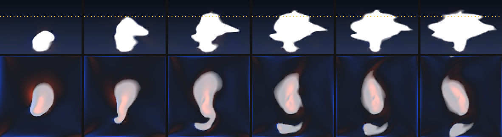

# Spike 04 — Does the mesocyclone work in 3D?

Spike 03 established that a directed 2D storm goes exactly where it is told,
that a stability layer sets the cloud top, and that the anvil spreads once
capped. It also found the one thing a vertical slice structurally cannot
answer: at 3.5 m/s/km of shear the 2D storm **tore apart**, because 2D has no
mechanism for the rotating updraft that lets a real supercell survive shear.

This spike closes that gap before Phase 04 commits to it.

**Verdict: a directed rotating updraft is stable, long-lived, controllable, and
survives shear that disrupted the 2D storm.** With two honest limitations:
rotation does not emerge from the hodograph at this resolution, and imposed
axisymmetric swirl does not by itself produce the *asymmetric* supercell
structure.



*Top row: vertical slice through the storm, cloud in white, dashed line at the
prescribed tropopause. Bottom row: plan view at 4 km — vertical vorticity red
(cyclonic) / blue, cloud overlaid. The coherent red core inside the cloud is
the mesocyclone; note the hook-shaped appendage curling off the south flank.*

---

## Method

3D staggered (MAC) grid, 96 × 96 × 64 cells at 250 m — 24 × 24 × 16 km — over
2400 s of storm time at dt = 3 s. Same physics as Spike 03 (semi-Lagrangian
advection, buoyancy with condensate loading, saturation adjustment with latent
heat, Jacobi projection, sponge layer), extended to three dimensions and
parallelised with OpenMP. Roughly 25 s per run on 8 cores.

**No vorticity confinement**, per Spike 03's finding.

Rotation is *directed*, not awaited: the tangential wind about the forcing
column is relaxed toward a Rankine-like profile peaking at `swirlRadius`, over
a height band. The parameter is a rotation **speed** that can be asked for
directly.

```
build.bat
build\spike04.exe --all             # the experiment suite (~10 min)
build\spike04.exe --demo            # one run, evolution table
build\spike04.exe --film out.bmp    # the filmstrip above
```

---

## Results

### A. Rotation keeps the updraft alive

Forcing ramps off at 1500 s, so a storm still running at 2400 s is sustaining
itself.

| Swirl | Cloud top | Peak updraft | **Late updraft** | w–ζ correlation |
|---:|---:|---:|---:|---:|
| 0 m/s | 11 125 m | 21.8 m/s | 37.8 m/s | −0.16 |
| 12 m/s | 13 125 m | 55.1 m/s | **66.8 m/s** | **0.79** |

Rotation adds 2 km of cloud top and 77% to the late updraft, and turns an
uncorrelated flow into a coherent rotating one.

### B. The mesocyclone tracks the rotation asked for

| Swirl | Peak ζ | **w–ζ correlation** | Late updraft |
|---:|---:|---:|---:|
| 0 m/s | 0.0308 /s | −0.16 | 37.8 m/s |
| 6 m/s | 0.0163 /s | 0.28 | 71.1 m/s |
| 12 m/s | 0.0271 /s | 0.79 | 66.8 m/s |
| 18 m/s | 0.0314 /s | 0.84 | 67.0 m/s |

The correlation — the standard mesocyclone diagnostic, measuring whether
vertical velocity and vertical vorticity vary together — rises monotonically
and is directly controllable.

**Peak ζ is not a usable control readout.** It is non-monotonic because it
picks up the largest vorticity anywhere in the mid-levels, including transient
small-scale shear that has nothing to do with the mesocyclone. Phase 04 should
steer on the correlation, not the peak.

### C. The 3D storm survives shear that killed the 2D one

| Shear | Cloud top | Peak updraft | Late updraft |
|---:|---:|---:|---:|
| 0.0 m/s/km | 14 875 m | 63.5 m/s | 81.6 m/s |
| 2.0 m/s/km | 13 625 m | 60.4 m/s | 75.4 m/s |
| 3.7 m/s/km | 13 125 m | 55.1 m/s | 66.8 m/s |
| 5.3 m/s/km | 12 875 m | 48.9 m/s | 67.5 m/s |

Cloud top declines 13% across the whole range and the storm stays strong
throughout. In 2D over a comparable range, cloud top **collapsed** from 12.8 km
to 9.2 km and the tilt metric reversed as the updraft was torn apart.

**This is the result the spike existed to get.** Act IV of the storm arc is
supported.

### D. Placement still holds in 3D

| Asked for | Updraft centre | Error |
|---:|---:|---:|
| 8 000 m | 7 587 m | −413 m |
| 12 000 m | 11 583 m | −417 m |
| 16 000 m | 15 583 m | −417 m |

A constant offset of about 1.7 cells, identical at every position — systematic
and therefore calibratable, exactly as in 2D.

### E. Fully deterministic

Four seeds produced **bit-identical** results (cloud top sd 0.0%, late updraft
identical to 0.1 m/s). At this resolution and forcing strength the ±0.025 K
initial noise is entirely irrelevant.

This reinforces Spike 03's conclusion and sharpens it: **run-to-run variety
cannot come from noise seeds at all.** It has to come from perturbing the
sounding and forcing vector — which is what the plan specifies.

### F. Stable

800 steps, worst CFL 0.84, peak speed 70.1 m/s, no divergence.

---

## Limitation 1: rotation does not emerge from the hodograph

With swirl forcing off, so any rotation would have to come from the solver
tilting ambient horizontal vorticity into the vertical:

| Hodograph curvature | Peak ζ | w–ζ correlation | Late updraft |
|---:|---:|---:|---:|
| 0.00 (straight) | 0.0338 /s | −0.00 | 64.1 m/s |
| 0.33 | 0.0342 /s | 0.06 | 63.7 m/s |
| 0.67 | 0.0290 /s | −0.11 | 49.1 m/s |
| 1.00 (quarter circle) | 0.0308 /s | −0.16 | 37.8 m/s |

No coherent mesocyclone at any curvature, and increasing curvature actively
*hurts* the storm.

Two causes, and I did not separate them:

1. **The storm-relative frame is wrong.** I remove the layer-mean wind, but a
   real supercell deviates hard to the right of the mean wind. In the frame I
   use, the low-level shear is along x and the storm-relative wind is along −x,
   which makes the ambient vorticity purely **crosswise** — precisely the
   splitting-storm configuration that produces a symmetric counter-rotating
   pair and no net rotation.
2. **250 m cells with semi-Lagrangian advection are too diffusive** to develop
   the tilting mechanism cleanly.

Either way the conclusion for the project is the same, and it is the plan's own
philosophy: **direct the rotation, do not wait for it.** Chasing emergence here
would be solving a research problem the screensaver does not need.

## Limitation 2: imposed swirl does not produce the asymmetric structure

| Swirl | Updraft-to-precipitation separation |
|---:|---:|
| 0 m/s | 3 180 m |
| 6 m/s | 1 055 m |
| 12 m/s | 508 m |
| 18 m/s | 449 m |

Separation *decreases* with rotation, the opposite of the supercell
expectation — and the reason is instructive. Axisymmetric swirl makes the storm
symmetric about the forcing column, so precipitation forms a ring whose
centroid sits on the updraft. The large offset at zero swirl is not supercell
structure at all; it is just the storm being tilted downshear.

The plan is unaffected, because it already treats these as separately authored
features: the acceptance checklist lists the **rain shaft**, the **RFD clear
slot** and the **wall cloud** as things to place deliberately, not to wait for.
This result confirms that was the right call — a hook echo and a displaced
precipitation core will have to be art-directed, and the plan's procedural
layer is where they belong.

The filmstrip does show a hook-shaped cloud appendage curling off the flank, so
some asymmetry is present; the centroid metric simply does not capture it.

## Other caveats

- 0.59 M cells here against the plan's 192 × 192 × 128 = 4.7 M target, so this
  says nothing about GPU cost. At 25 s per 800-step run on 8 cores, the CPU is
  about 31 ms/step for one eighth of the target grid — the plan's assumption
  that this belongs on the GPU stands.
- Updrafts of 50–80 m/s are at or above the top of the realistic range, driven
  by forcing tuned to get a 3D plume to the tropopause. Control relationships
  are unaffected.
- One bug worth recording: the first swirl implementation relaxed `u` and `v`
  independently, each using only its own contribution to the tangential wind.
  The residual error varies as cos²/sin² of azimuth and appeared as a spurious
  **four-armed spiral** around an axisymmetric forcing. Computing the tangential
  component from both interpolated components fixed it, and improved the
  correlation from 0.75 to 0.79 and the separation from 168 m to 508 m.
